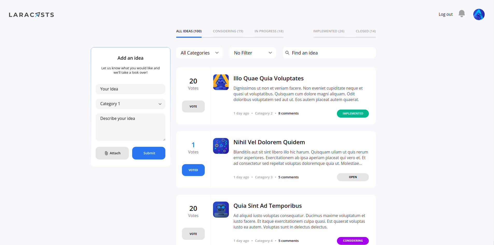
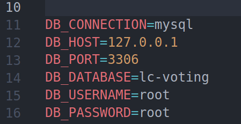
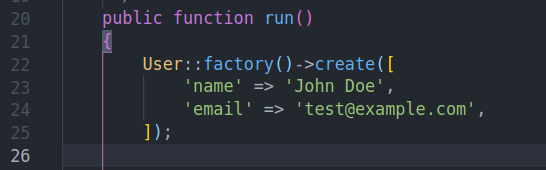
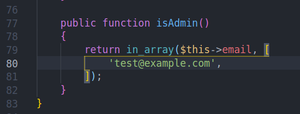
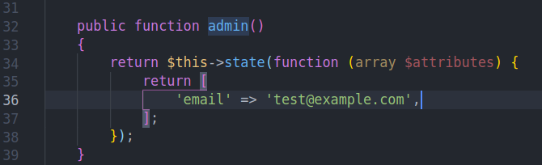
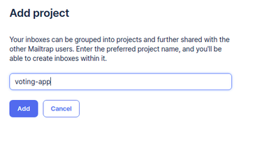
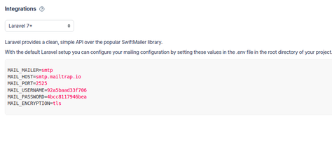
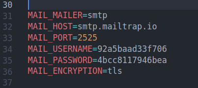
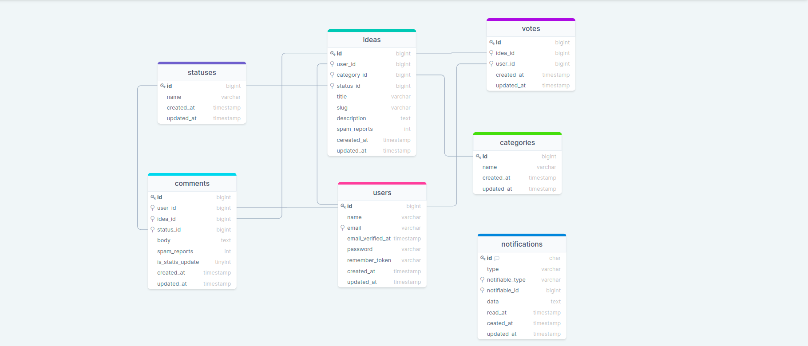

## Table of Contents

*  [ About The App.](#about)
*  [ Prerequisites. ](#pre)
*  [ Install and Run.](#iar)
*  [ Administrator. ](#administrator)
*  [ Email. ](#mailtrap)
*  [ Database structure.](#db)
*  [ Resources.](#resources)

<a name="about"></a>

## About the application

Laracasts Voting is a web application where you can find a lot of ideas posted by different users. You can have a look on these ideas as a guest, share your opinion or add your idea as an authenticated user.

## App looks like 

---
<a name="pre"></a>

## Prerequisites
### <a  href="https://www.php.net/downloads" target="_blank"> version 7.4 and up </a>  

### <a href="https://nodejs.org/en/" target="_blank">  version 16 and up </a> 
### <a href="https://www.mysql.com/downloads/" target="_blank">  version 8 and up </a> 

###  version 8 and up

## Packages


<a name="iar"></a>
##  Install and Run

1. Downoad [ZIP](https://github.com/RedberryInternship/davitlabadze-movie-quotes/archive/refs/heads/main.zip) or Clone: ```https://github.com/RedberryInternship/davitlabadze-movie-quotes.git```
2. Install all dependencies using the ```composer i``` command
3. Install NPM using the ```npm i``` command
4. Run the command ```npm run watch``` or ```npm run dev```
5. Create env file Run the command ```cp .env.example .env```
6. Run  the command ```php artisan key:generate``` 
7. Configured database: 
    
9. See Section [ Administrator. ](#administrator) This is a prerequisite for executing the following commands
10. Run the command  ```php artisan migrate```
11. Run the command  ```php artisan serve```

<a name="administrator"></a>

## Administrator
#### About administrator
    Entering fake information in the database will automatically create an administrator.

> Use to log in Email: `test@example.com` Password: `password` or modify it in `databaseSeeder.php`  
>  
> If you do not make the change, you can continue with [ the installation ](#iar) 
>>  ***NOTE:*** The password will remain the same despite the changes Password: `password`


#### Set administrator status

>Add the user email in `User.php` to which you want to have administrator privileges.


#### Avatar
> If you log in to the site [Gravatar](https://en.gravatar.com/) and register with your email, your existing email photo will be automatically uploaded to your avatar.
#### Test adminsetstatus

>If you run the test, remember that you must enter the `UserFactory.php` email that you are using. This function is related to `AdminSetStatusTest.php`.



<a name="mailtrap"></a>
##  For email


####  About Mailtrap
    Email sandbox service for devs, QAs, marketers, and managers.
####  Why we use it
    You can use mailtrap to check if the app sends emails.

####  How to install Miltrap

1. Log in to [Mailtrap](https://drawsql.app/).
2. Add project.

   
3. Integrations.
   
   
4. Add the given integration to the env file.
   
   

<a name="db"></a>

## Database structure


<a name="resources"></a>
##  Resources

* [DrawSQL](https://drawsql.app/)   
* [TailwindCss](https://tailwindcss.com/docs/guides/laravel)
* [Mailtrap](https://drawsql.app/)   

